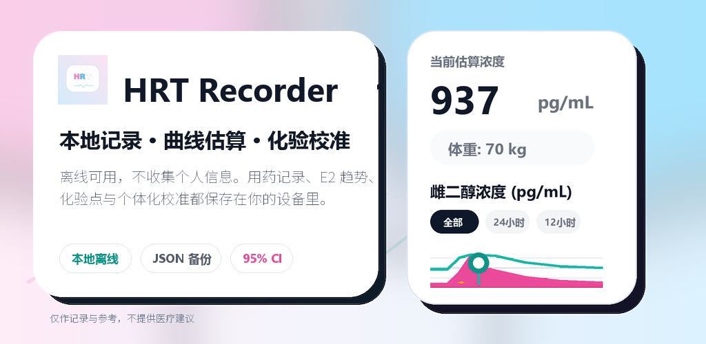
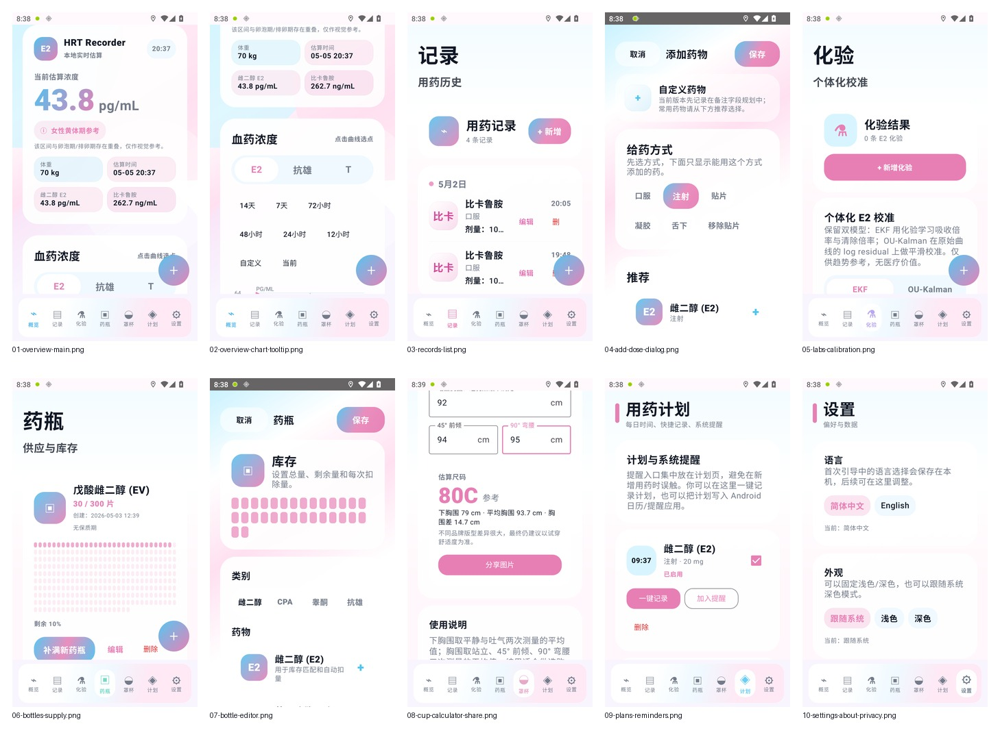

<p align="center">
  
</p>

<h1 align="center">HRT Recorder</h1>

<p align="center">
  一个面向 Android 的本地 HRT 记录、趋势估算与离线数据管理工具。<br />
  数据留在本机，记录由你掌握。
</p>

<p align="center">
  <a href="https://github.com/NoMTF/HRT-Recorder/releases/latest">
    
  </a>
  <a href="https://github.com/NoMTF/HRT-Recorder/releases">
    
  </a>
</p>

<p align="center">
  
  
  
</p>

---

## 这是什么

HRT Recorder 想解决的事情很直接：把每天分散的记录、计划、库存、化验和趋势估算整理到一个可以离线使用的 Android 应用里。

它不依赖网站账号，不需要云同步，也不会因为某个在线服务消失、封禁或停服而让你的本地记录失控。你可以把它当作一个私人记录本，一个趋势草稿板，或者一个只属于你自己的 HRT 时间线。

> 重要说明：本软件仅用于本地记录、离线趋势估算和个人回顾，不提供诊断、治疗、处方、剂量建议或临床决策支持；任何健康相关决定都应咨询合格专业人员。

## 下载

| 文件 | 用途 | 地址 |
| --- | --- | --- |
| `APK` | Android 直接安装测试版 | [下载最新版 APK](https://github.com/NoMTF/HRT-Recorder/releases/latest) |
| `AAB` | Google Play 发布构建 | [查看 Release 附件](https://github.com/NoMTF/HRT-Recorder/releases/latest) |

如果你只是想在手机上安装，通常下载 Release 里的 `sideload.apk` 即可。

## 功能轮廓

| 模块 | 能做什么 |
| --- | --- |
| 概览 | 查看当前估算值、曲线、时间点预览、近期状态卡和分享图 |
| 计划 | 建立每日或每周计划，配合本地提醒与系统提醒 |
| 记录 | 添加、编辑、删除实际记录，支持日历查看 |
| 化验 | 录入化验结果，进行 E2 个体化校准、置信区间和异常点提示 |
| 药瓶 | 管理库存、保质期、补满、扣减与余量显示 |
| 罩杯 | 离线参考计算与分享图生成 |
| 设置 | 语言、主题、导入导出、隐私协议、关于页面 |

## 目前支持

| 类别 | 内容 |
| --- | --- |
| E2 | E2、EB、EV、EC、EN 等记录与曲线 |
| 抗雄 | CPA 及常见抗雄记录；部分药物提供趋势曲线或参考趋势 |
| T | TC、TE、TU 等记录与趋势曲线 |
| 化验单位 | `pg/mL`、`pmol/L`、`ng/dL` 等常见换算 |
| 导入导出 | JSON、CSV、HTML 报告，兼容部分 hrt.mahiro 备份结构 |

## 截图

<p align="center">
  
</p>

## 隐私边界

HRT Recorder 默认以本地使用为前提设计：

- 不要求登录。
- 不申请网络权限。
- 不上传记录、化验、计划、体重、库存或设备标识。
- 不接入广告、统计 SDK、远程配置或云同步。
- 导出的 JSON、CSV、HTML 和图片由用户自行保存与分享。
- 提醒功能使用 Android 本地通知与系统提醒/日历意图。

公开隐私政策与用户协议：

[https://orange-truth-08b4.guhuao666.workers.dev/](https://orange-truth-08b4.guhuao666.workers.dev/)

## 构建

需要 Android SDK、JDK 17 和 Gradle。根目录执行：

```powershell
.\gradlew.bat :app:assembleSideloadRelease
.\gradlew.bat :app:bundlePlayRelease
```

默认产物：

| 类型 | 路径 |
| --- | --- |
| Sideload APK | `app/build/outputs/apk/sideload/release/app-sideload-release.apk` |
| Play AAB | `app/build/outputs/bundle/playRelease/app-play-release.aab` |

正式签名文件不会进入仓库。发布前请在本地配置自己的 `keystore.properties`。

## 参考来源

本项目在功能、数据结构、药代参数、UI 取舍和说明文档层面参考过以下项目或资料。参考不代表完全复刻，也不代表这些项目对本应用负责。

| 来源 | 链接 |
| --- | --- |
| Journey | [x.com/m1zukiqaqaqaq](https://x.com/m1zukiqaqaqaq) |
| HRT-Recorder-online | [github.com/LaoZhong-Mihari/HRT-Recorder-online](https://github.com/LaoZhong-Mihari/HRT-Recorder-online) |
| Transmtf-HRT-Tracker | [github.com/TransmtfTeam/Transmtf-HRT-Tracker](https://github.com/TransmtfTeam/Transmtf-HRT-Tracker) |
| HRT-Recorder-PKcomponent-Test | [github.com/LaoZhong-Mihari/HRT-Recorder-PKcomponent-Test](https://github.com/LaoZhong-Mihari/HRT-Recorder-PKcomponent-Test) |
| hrt.mahiro.uk | [hrt.mahiro.uk](https://hrt.mahiro.uk/) |
| MtF-wiki cup calculator | [mtf.wiki/zh-cn/cup-calculator](https://mtf.wiki/zh-cn/cup-calculator) |

更多算法与参数说明见：

- [REFERENCES.md](./REFERENCES.md)
- [Algorithm Explanation.md](./Algorithm%20Explanation.md)
- [ANTIANDROGEN_PK_REFERENCES.md](./ANTIANDROGEN_PK_REFERENCES.md)

## 使用边界

当前仓库未附加公开开源许可证。源码公开用于审阅、学习与协作参考；再分发、商用、改名发布、二次上架或制作衍生发行版前，请先取得明确许可。

---

<p align="center">
  HRT Recorder<br />
  本地记录，离线估算，安静地把数据交还给用户。
</p>
